<div align="center">

  

  <br /><br />

  # Kean AIEducator

  <h3>AI-Powered Career Platform for Kean University Students</h3>

  <br />

  [](https://aieducator.jamesmardi475.workers.dev)

  <br />

  
  
  
  
  

  <br /><br />

  <table>
    <tr>
      <td align="center">
        <br />
        <strong>This is a functional prototype</strong> built for academic purposes at Kean University.<br/>
        Real AI. Real analysis. Real career tools.<br/>
        Use any email/password to explore (no real authentication).<br />
        <br />
      </td>
    </tr>
  </table>

</div>

<br />

---

<br />

<p align="center">
  
</p>

<div align="center">
  <h2>The Landing Experience</h2>
  <p>A fully interactive 3D globe built with Three.js renders in real-time. Animated city-to-city connection arcs, 2000+ floating particles, and a mouse-tracked parallax camera create an immersive first impression. The Kean University seal floats with a pulsing glow effect above the hero text.</p>
</div>

<br />

<table>
<tr>
<td width="60%">
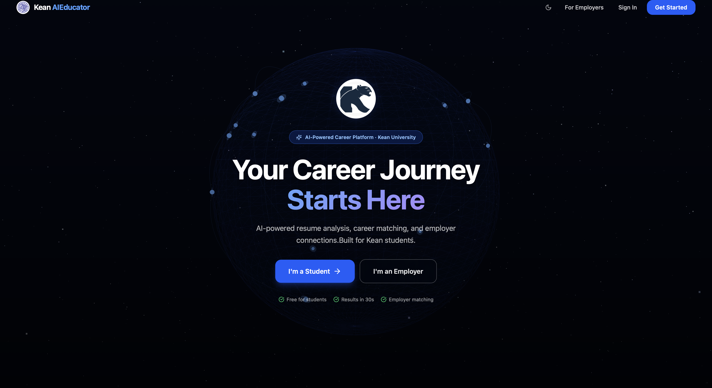
</td>
<td width="40%" valign="top">
<br /><br />
<h3>Two Clear Paths</h3>
<p>The landing page immediately splits users into two flows: <strong>Students</strong> looking for career tools, and <strong>Employers</strong> looking to hire Kean talent. Badges at the bottom reinforce the value: free for students, results in 30 seconds, employer matching built in.</p>
<p>The nav bar features the spinning Kean seal, dark mode toggle, and direct access to both portals.</p>
</td>
</tr>
</table>

<br />

<table>
<tr>
<td width="40%" valign="top">
<br /><br />
<h3>Built for Kean</h3>
<p>Real campus imagery of the GLAB building with an animated Kean Burns zoom effect. The platform was designed specifically around Kean's 16,000+ students across 50+ degree programs.</p>
<p>Below the campus showcase, three pillars explain what the platform does: <strong>Resume Intelligence</strong>, <strong>Career Matching</strong>, and the <strong>Employer Portal</strong>.</p>
</td>
<td width="60%">
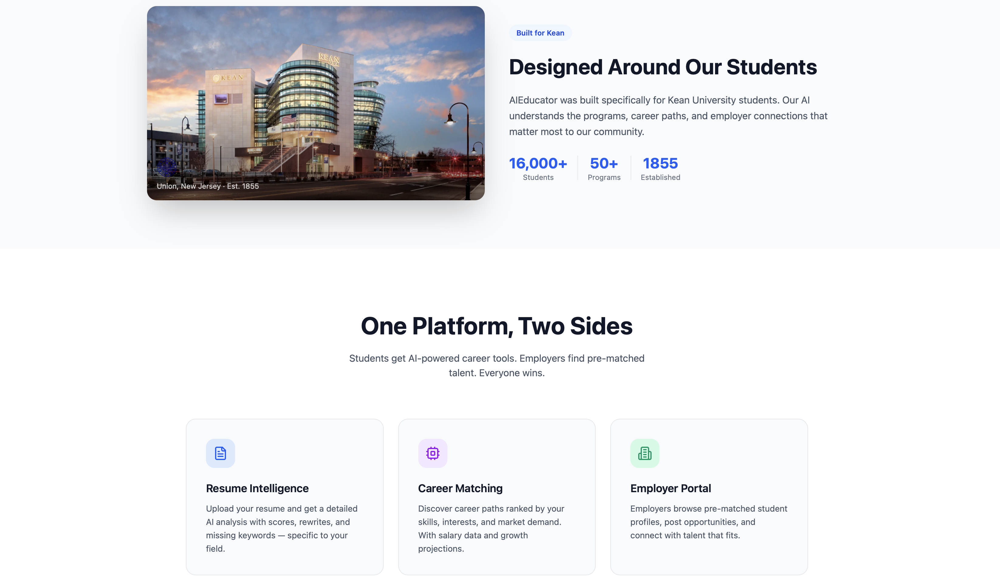
</td>
</tr>
</table>

<br />

<table>
<tr>
<td width="60%">
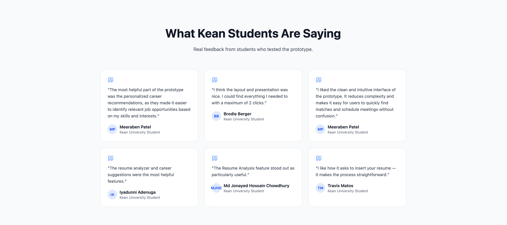
</td>
<td width="40%" valign="top">
<br /><br />
<h3>Real Student Feedback</h3>
<p>Quotes from 7 Kean University students who tested the prototype during a formal usability evaluation. Each card shows the student's name, their avatar initials, and their specific feedback about the platform.</p>
<p>This isn't placeholder text. These are real responses collected during Phase B of our research study.</p>
</td>
</tr>
</table>

<br />

---

<br />

<div align="center">
  <h2>The Student Journey</h2>
  <p>Five guided steps from profile creation to personalized career intelligence. Every step is powered by real AI, not templates or hardcoded rules.</p>
</div>

<br />

<table>
<tr>
<td width="40%" valign="top">
<br /><br />
<h3>Step 1: Sign In</h3>
<p>Split-screen layout inspired by modern SaaS apps. The left panel shows the Kean campus building with a dark overlay, an animated floating university seal with a pulsing glow, and key stats (30s analysis, 20+ career paths, free).</p>
<p>The right panel has a clean form with university email and password fields. An "I'm an Employer" option links to the separate employer portal. Fully responsive: collapses to a single column on mobile.</p>
</td>
<td width="60%">

</td>
</tr>
</table>

<br />

<table>
<tr>
<td width="60%">
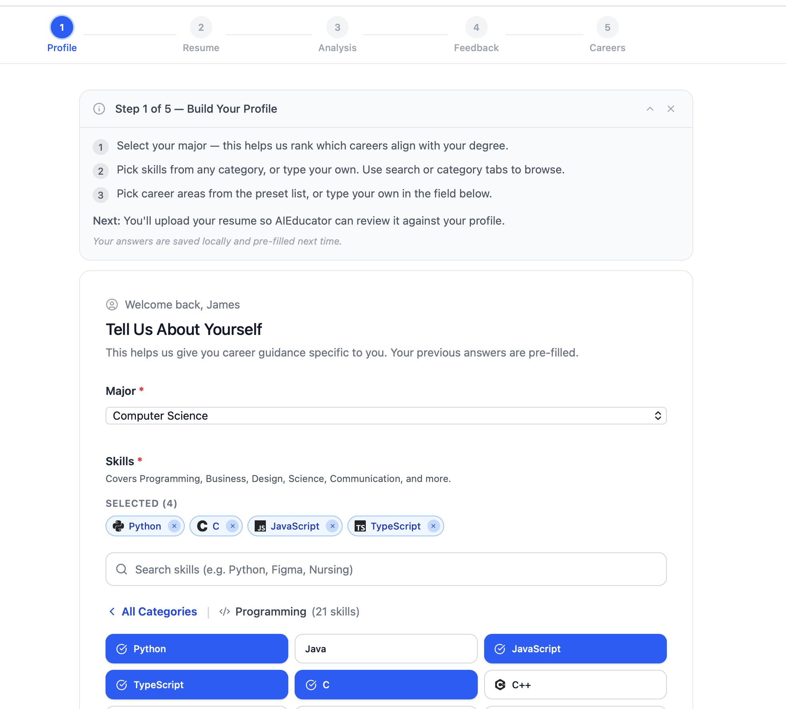
</td>
<td width="40%" valign="top">
<br /><br />
<h3>Step 2: Build Your Profile</h3>
<p>Students select their major from a dropdown, then pick skills from searchable categorized lists: Programming (21 skills), Business, Design, Science, Communication, and more. Skills are shown as colored tags with brand icons.</p>
<p>Career interests are selected the same way. All answers are saved to localStorage and pre-filled on return visits. A progress stepper at the top shows where you are in the 5-step flow.</p>
</td>
</tr>
</table>

<br />

<table>
<tr>
<td width="40%" valign="top">
<br /><br />
<h3>Step 3: Upload Resume</h3>
<p>Two upload methods: drag-and-drop a file (PDF, DOCX, DOC, TXT) or click the "Paste Text" tab and copy-paste directly. The text area shows a live character count and validates the input format.</p>
<p>The demo uses the fictional persona Rayquan Lee, a Kean CS student, to showcase the full analysis flow. A step guide at the top explains exactly what to do and what happens next.</p>
</td>
<td width="60%">
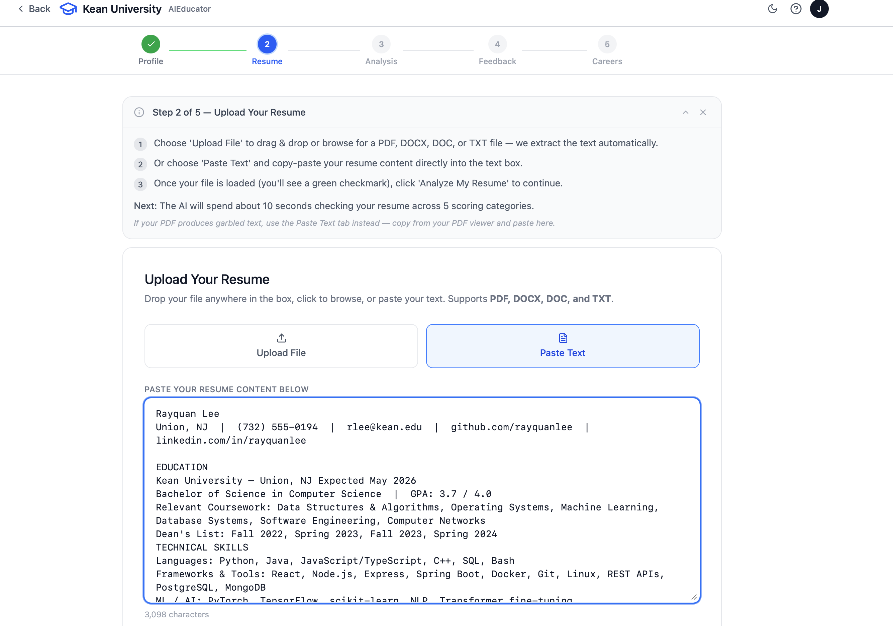
</td>
</tr>
</table>

<br />

<table>
<tr>
<td width="60%">
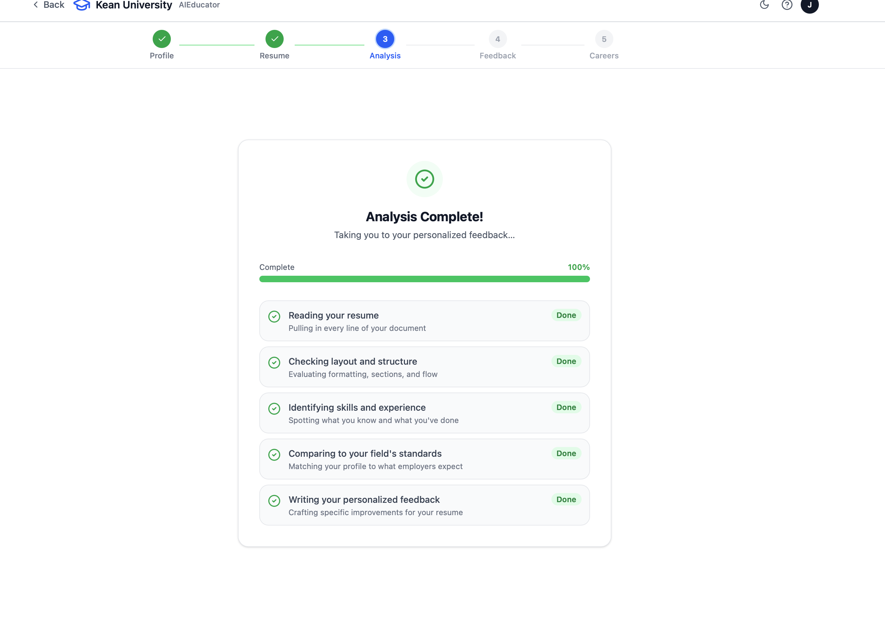
</td>
<td width="40%" valign="top">
<br /><br />
<h3>Step 4: AI Analyzes Your Resume</h3>
<p>Llama 3.3 70B (via Groq) reads every line of the uploaded resume in real-time. The UI shows five animated progress steps: Reading, Checking Layout, Identifying Skills, Comparing to Field Standards, and Writing Feedback.</p>
<p>An elapsed timer shows how long the analysis takes. Rotating resume tips teach students useful career advice while they wait. This is real AI analysis, not hardcoded. Every result is unique.</p>
</td>
</tr>
</table>

<br />

<table>
<tr>
<td width="40%" valign="top">
<br /><br />
<h3>Step 5: Get Real Feedback</h3>
<p>The AI returns a detailed analysis: an overall score out of 100, a letter grade (A through F), and a 5-category breakdown covering Completeness, Keywords, Formatting, Achievements, and Best Practices.</p>
<p>The "What's Working" section highlights specific strengths referencing actual resume content. The "Bullet Point Improvements" section identifies weak bullets and provides 3 concrete STAR-method rewrites for each one. Missing keywords show exactly which terms recruiters in the student's field expect to see.</p>
</td>
<td width="60%">
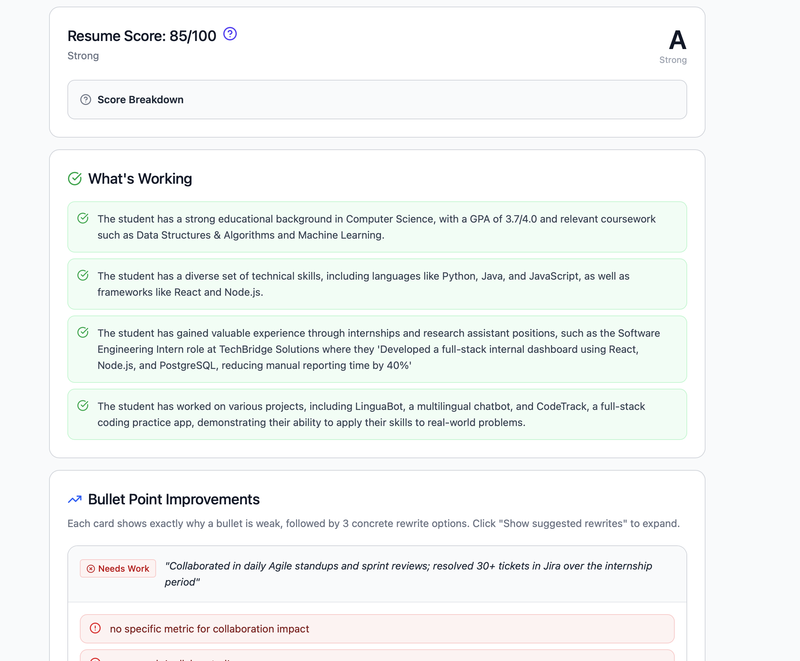
</td>
</tr>
</table>

<br />

---

<br />

<div align="center">
  <h2>Student Dashboard</h2>
  <p>Everything a student needs, in one place. No clutter, no confusion.</p>
</div>

<br />

<table>
<tr>
<td width="60%">
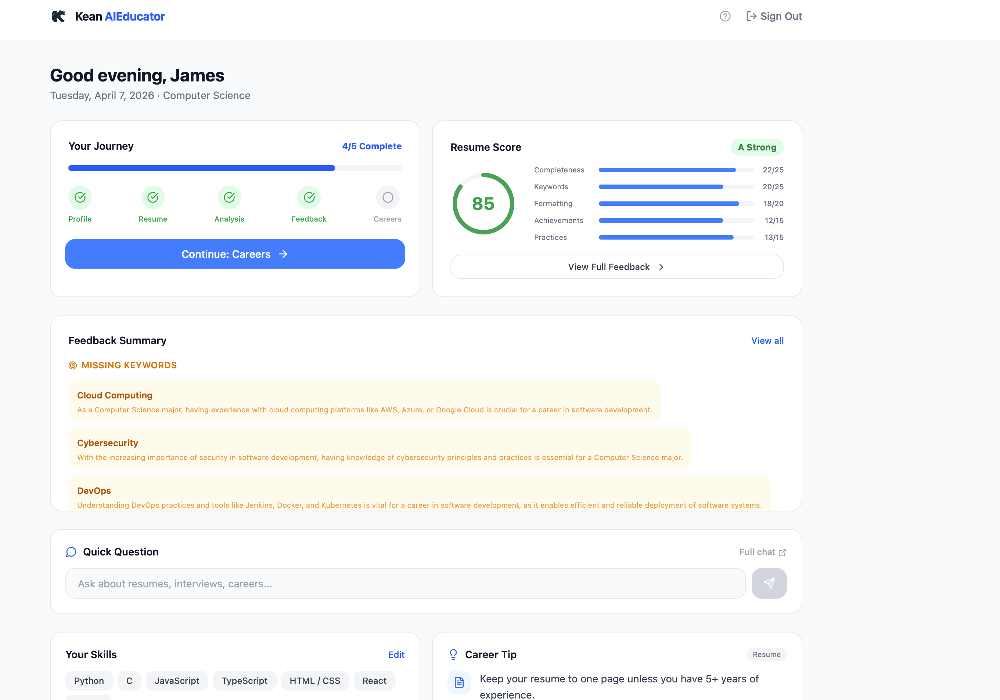
</td>
<td width="40%" valign="top">
<br /><br />
<h3>Your Command Center</h3>
<p>Time-based personalized greeting ("Good morning, James"). A 5-step progress tracker shows completed steps with green checkmarks. The animated SVG score ring displays the resume score with a color-coded breakdown across all 5 dimensions.</p>
<p>The feedback carousel auto-rotates between Strengths, Missing Keywords, and Areas to Improve with clickable dot navigation. An inline Quick Question bar lets students ask the AI anything without leaving the dashboard. Skills are displayed as tags, and a Career Tip section rotates helpful advice every 7 seconds.</p>
<p>External links to LinkedIn Jobs, Handshake, Indeed, and Kean Career Services are at the bottom.</p>
</td>
</tr>
</table>

<br />

---

<br />

<div align="center">
  <h2>Career Center</h2>
  <p>Two tabs. AI-generated career paths and real career fair employers. One goal: get hired.</p>
</div>

<br />

<table>
<tr>
<td width="60%">
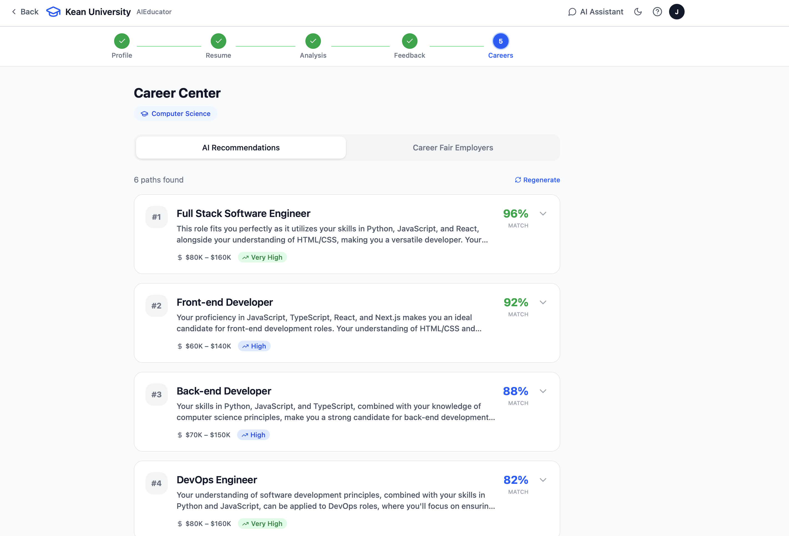
</td>
<td width="40%" valign="top">
<br /><br />
<h3>AI Recommendations</h3>
<p>The AI generates 6 personalized career paths ranked by match score (70-98%). Each card shows the job title, a personalized explanation of why it fits, salary range, and market demand level (Very High, High, Moderate).</p>
<p>Expanding a card reveals: skills you already have (green tags), skills to learn (amber tags), a day-in-life description, the career growth path, and direct job search links to <strong>LinkedIn</strong>, <strong>Indeed</strong>, and <strong>Handshake</strong> with the job title pre-filled. Hit "Regenerate" for fresh AI results anytime.</p>
</td>
</tr>
</table>

<br />

<table>
<tr>
<td width="40%" valign="top">
<br /><br />
<h3>Career Fair Employers</h3>
<p>Real companies that actively recruit Kean University students: RWJBarnabas Health, Deloitte, NJ Transit, Amazon, Hackensack Meridian Health, and KPMG. Each card shows the company name, industry, location, available roles, and hiring type.</p>
<p>Expanding a card reveals four actions: <strong>Apply Now</strong> (links to the real careers page), <strong>Schedule Interview</strong>, <strong>Send Resume</strong>, and <strong>Ask AI</strong>. Two AI-powered buttons generate company-specific <strong>Preparation Tips</strong> and <strong>Interview Questions</strong> on demand.</p>
</td>
<td width="60%">
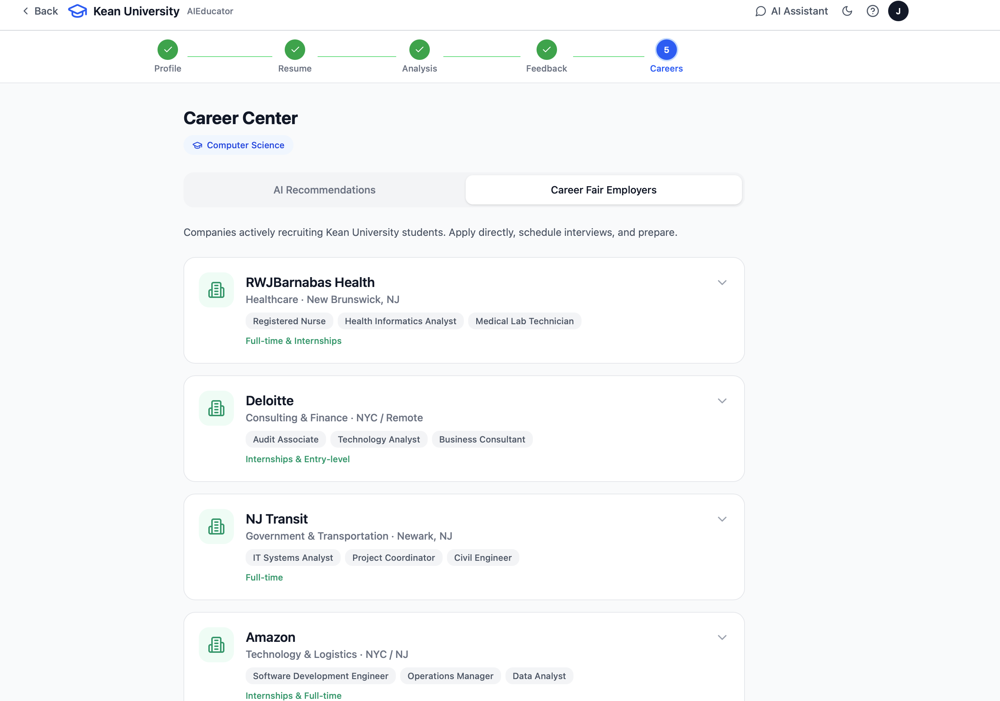
</td>
</tr>
</table>

<br />

---

<br />

<div align="center">
  <h2>AI Assistant</h2>
  <p>A personalized career advisor that actually knows who you are.</p>
</div>

<br />

<table>
<tr>
<td width="60%">
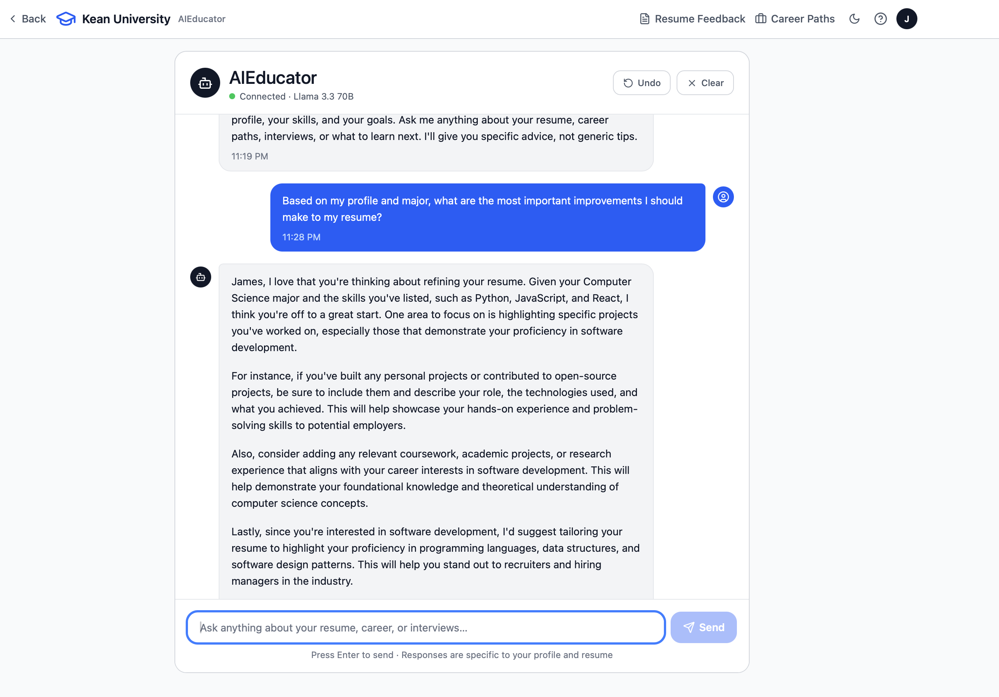
</td>
<td width="40%" valign="top">
<br /><br />
<h3>Real Conversations</h3>
<p>Full chat interface with real-time streaming responses powered by Llama 3.3 70B. The AI has access to the student's profile, major, selected skills, career interests, and uploaded resume content.</p>
<p>Every response is personalized. It references the student's actual background instead of giving generic advice. The assistant also handles general questions: math, homework, life advice, anything a student might need help with.</p>
<p>Features include: quick action prompts for common questions, undo last message, clear chat, and timestamps on every message. A setup progress bar guides students who haven't completed all steps yet.</p>
</td>
</tr>
</table>

<br />

---

<br />

<div align="center">
  <h2>Employer Portal</h2>
  <p>A separate experience for employers, with its own branding and flow.</p>
</div>

<br />

<table>
<tr>
<td width="40%" valign="top">
<br /><br />
<h3>Hire Kean Talent</h3>
<p>The employer portal has its own landing page with an emerald green accent theme to visually distinguish it from the student blue side. It features a four-step onboarding flow: Create Company Profile, Set Your Criteria, AI Matches Candidates, and Connect and Hire.</p>
<p>The employer login mirrors the student login with a split-screen layout. After signing in, employers see a dashboard with: Post a Position, Browse Candidates, and Analytics cards. Stats show active postings, total applicants, average match score, and scheduled interviews.</p>
</td>
<td width="60%">
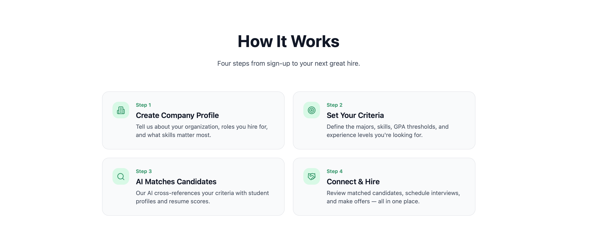
</td>
</tr>
</table>

<br />

---

<br />

<div align="center">

  ## Student Features

</div>

<br />

<table>
<tr>
<td align="center" width="25%">
<br />
<br /><br />
AI scores across 5 dimensions with specific suggestions
<br /><br />
</td>
<td align="center" width="25%">
<br />
<br /><br />
3 STAR-method alternatives for each weak bullet
<br /><br />
</td>
<td align="center" width="25%">
<br />
<br /><br />
Field-specific terms recruiters look for
<br /><br />
</td>
<td align="center" width="25%">
<br />
<br /><br />
6 AI-ranked careers with salary and demand data
<br /><br />
</td>
</tr>
<tr>
<td align="center">
<br />
<br /><br />
Direct LinkedIn, Indeed, Handshake links
<br /><br />
</td>
<td align="center">
<br />
<br /><br />
Real employers with AI interview prep
<br /><br />
</td>
<td align="center">
<br />
<br /><br />
Personalized advisor that knows your profile
<br /><br />
</td>
<td align="center">
<br />
<br /><br />
Score ring, feedback carousel, tips, Q&A
<br /><br />
</td>
</tr>
</table>

<br />

<div align="center">

  ## Employer Features

</div>

<br />

<table>
<tr>
<td align="center" width="25%">
<br />
<br /><br />
Dedicated landing, login, dashboard
<br /><br />
</td>
<td align="center" width="25%">
<br />
<br /><br />
Internships and full-time listings
<br /><br />
</td>
<td align="center" width="25%">
<br />
<br /><br />
Students matched by skills and interests
<br /><br />
</td>
<td align="center" width="25%">
<br />
<br /><br />
Applicant stats and engagement
<br /><br />
</td>
</tr>
</table>

<br />

---

<br />

<div align="center">

  ## Tech Stack

  <br />

  
  
  
  
  
  
  

</div>

<br />

---

<br />

<div align="center">

  ## Run Locally

</div>

<br />

```bash
git clone https://github.com/Brago475/AIEducator.git
cd AIEducator
echo "VITE_GROQ_KEY=your_key_here" > .env
npm install
npm run dev
```

<div align="center">
  <p>Free API key at <a href="https://console.groq.com">console.groq.com</a></p>
</div>

<br />

---

<br />

<div align="center">

  ## Prototype Limitations

  <br />

  | | |
  |:---:|:---|
  | **No backend** | All data stored in browser localStorage |
  | **No real auth** | Login is simulated for demo purposes |
  | **Client-side API key** | Would need a server proxy for production |
  | **No persistence** | Data is lost if browser storage is cleared |
  | **Static employer list** | Would need a real employer management system |
  | **Simulated actions** | Interview requests and resume sends are prototyped |

</div>

<br />

---

<br />

<div align="center">

  ## What Students Said

</div>

<br />

<table>
<tr>
<td width="33%" align="center">
<br />

> *"The personalized career recommendations made it easier to identify relevant job opportunities."*

**Meeraben Patel**
<br /><br />
</td>
<td width="33%" align="center">
<br />

> *"I could find everything I needed with a maximum of 2 clicks."*

**Brodie Berger**
<br /><br />
</td>
<td width="33%" align="center">
<br />

> *"The resume analyzer and career suggestions were the most helpful."*

**Iyadunni Adenuga**
<br /><br />
</td>
</tr>
<tr>
<td align="center">
<br />

> *"The clean interface reduces complexity and makes it easy to find matches."*

**Meeraben Patel**
<br /><br />
</td>
<td align="center">
<br />

> *"Resume Analysis stood out as particularly useful."*

**Md Jonayed Hossain Chowdhury**
<br /><br />
</td>
<td align="center">
<br />

> *"I like how it asks to insert your resume. Straightforward."*

**Travis Matos**
<br /><br />
</td>
</tr>
</table>

<br />

---

<br />

<div align="center">

  

  <br /><br />

  **Kean University, Union, New Jersey, Est. 1855**

  Academic prototype. Not for commercial use.

  <br />

  [](https://github.com/Brago475)

</div>