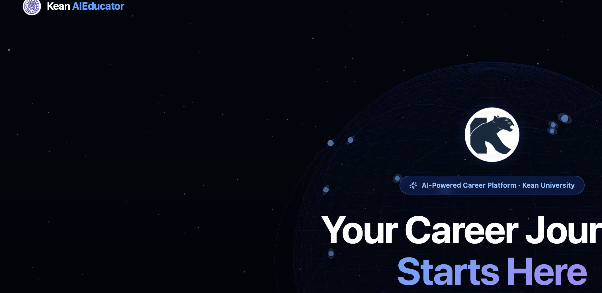

<div align="center">

  

  # Kean AIEducator

  ### AI-Powered Career Platform for Kean University Students

  <br />

  [](https://aieducator.jamesmardi475.workers.dev)

  <br />

  
  
  
  
  
  

  <br /><br />

  <table>
    <tr>
      <td>
        <strong>This is a functional prototype</strong> built for academic purposes at Kean University.<br/>
        Real AI. Real analysis. Real career tools.<br/>
        Use any email/password to explore (no real authentication).
      </td>
    </tr>
  </table>

</div>

<br />

---

<br />

<div align="center">
  <h2>The Landing Experience</h2>
  <p>Interactive 3D globe with animated city-to-city connections, floating particles, and mouse-tracked parallax. Built with Three.js.</p>
</div>

<p align="center">
  
</p>

<p align="center">
  
</p>

<br />

<div align="center">
  <h3>Kean Campus Showcase</h3>
  <p>Real campus imagery with Ken Burns animation. 16,000+ students across 50+ programs since 1855.</p>
</div>

<p align="center">
  
</p>

<br />

<div align="center">
  <h3>Real Student Feedback</h3>
  <p>Quotes from Kean students who tested the prototype during usability evaluation.</p>
</div>

<p align="center">
  
</p>

<br />

---

<br />

<div align="center">
  <h2>Student Journey</h2>
  <p>Five steps from profile to personalized career intelligence. Every step powered by real AI.</p>
</div>

<br />

<table>
<tr>
<td width="50%">

### Step 1: Sign In
Split-screen layout with Kean campus imagery, animated floating seal, and a clean form. Responsive on mobile.

</td>
<td width="50%">


</td>
</tr>
</table>

<br />

<table>
<tr>
<td width="50%">


</td>
<td width="50%">

### Step 2: Build Your Profile
Select your major, pick skills from categorized lists (21 programming skills, business, design, science, etc.), and choose career interests. Pre-filled on return visits.

</td>
</tr>
</table>

<br />

<table>
<tr>
<td width="50%">

### Step 3: Upload Resume
Drag-and-drop PDF, DOCX, DOC, or TXT. Or paste text directly. Character count and format validation built in. Supports the Rayquan Lee demo persona.

</td>
<td width="50%">


</td>
</tr>
</table>

<br />

<table>
<tr>
<td width="50%">


</td>
<td width="50%">

### Step 4: AI Analyzes Your Resume
Llama 3.3 70B reads every line. Five animated progress steps with elapsed timer and rotating resume tips. Every analysis is unique to the uploaded content.

</td>
</tr>
</table>

<br />

<table>
<tr>
<td width="50%">

### Step 5: Get Real Feedback
Score out of 100 across 5 dimensions. Letter grade. Strengths referencing your actual content. Weak bullets identified with 3 STAR-method rewrites each. Missing keywords for your field.

</td>
<td width="50%">


</td>
</tr>
</table>

<br />

---

<br />

<div align="center">
  <h2>Student Dashboard</h2>
  <p>Everything in one place. Progress tracker, animated score ring, rotating feedback carousel, inline AI Q&A, skills display, career tips, and job search links.</p>
</div>

<p align="center">
  
</p>

<br />

---

<br />

<div align="center">
  <h2>Career Center</h2>
  <p>Two tabs. AI-generated career paths and real career fair employers.</p>
</div>

<br />

<table>
<tr>
<td width="50%">

### AI Recommendations
6 personalized career paths ranked by match score. Salary ranges, demand levels, skills breakdown, growth paths, and direct job search links to **LinkedIn**, **Indeed**, and **Handshake**. Regenerate anytime for fresh results.

</td>
<td width="50%">


</td>
</tr>
</table>

<br />

<table>
<tr>
<td width="50%">


</td>
<td width="50%">

### Career Fair Employers
Real companies recruiting Kean students: RWJBarnabas Health, Deloitte, NJ Transit, Amazon, Hackensack Meridian, KPMG. Each card expands with: Apply Now, Schedule Interview, Send Resume, **AI-generated prep tips**, and **AI-generated interview questions**.

</td>
</tr>
</table>

<br />

---

<br />

<div align="center">
  <h2>AI Assistant</h2>
  <p>Full chat with streaming responses. Knows your profile, major, skills, and resume. Gives specific advice, not generic tips. Also answers general questions.</p>
</div>

<p align="center">
  
</p>

<br />

---

<br />

<div align="center">
  <h2>Employer Portal</h2>
  <p>Dedicated section with emerald green branding. Landing page, sign-in, and dashboard. Four-step hiring flow: Create Profile, Set Criteria, AI Matches, Connect and Hire.</p>
</div>

<p align="center">
  
</p>

<br />

---

<br />

## Features

<table>
<tr>
<td width="50%" valign="top">

### For Students

| | Feature |
|---|---|
| **Resume Analysis** | AI scores across 5 dimensions with specific suggestions |
| **Bullet Rewrites** | 3 STAR-method alternatives for each weak bullet |
| **Missing Keywords** | Field-specific terms recruiters look for |
| **Career Paths** | 6 AI-ranked careers with salary and demand data |
| **Job Search** | Direct LinkedIn, Indeed, Handshake links |
| **Career Fair** | Real employers with AI interview prep |
| **AI Chat** | Personalized advisor that knows your profile |
| **Dashboard** | Score ring, feedback carousel, tips, Q&A |

</td>
<td width="50%" valign="top">

### For Employers

| | Feature |
|---|---|
| **Portal** | Dedicated landing, login, dashboard |
| **Post Roles** | Internships and full-time listings |
| **AI Matching** | Students matched by skills and interests |
| **Analytics** | Applicant stats and engagement |

<br />

### Tech Stack

| | |
|---|---|
| **Frontend** | React 18, TypeScript, Tailwind 4, Vite 6 |
| **AI** | Llama 3.3 70B via Groq |
| **3D** | Three.js |
| **Hosting** | Cloudflare Pages |
| **Storage** | localStorage (prototype) |

</td>
</tr>
</table>

<br />

---

<br />

## Run Locally

```bash
git clone https://github.com/Brago475/AIEducator.git
cd AIEducator
echo "VITE_GROQ_KEY=your_key_here" > .env
npm install
npm run dev
```

Free API key at [console.groq.com](https://console.groq.com)

<br />

---

<br />

## Prototype Limitations

| Limitation | Detail |
|---|---|
| No backend | All data in browser localStorage |
| No real auth | Login is simulated |
| Client-side API key | Needs server proxy for production |
| No persistence | Data lost on browser clear |
| Static employer list | Needs real management system |
| Simulated actions | Interview/resume sends are prototyped |

<br />

---

<br />

## What Students Said

<table>
<tr>
<td width="33%">

> *"The personalized career recommendations made it easier to identify relevant job opportunities based on my skills and interests."*
>
> **Meeraben Patel**

</td>
<td width="33%">

> *"I could find everything I needed with a maximum of 2 clicks."*
>
> **Brodie Berger**

</td>
<td width="33%">

> *"The resume analyzer and career suggestions were the most helpful features."*
>
> **Iyadunni Adenuga**

</td>
</tr>
<tr>
<td>

> *"The clean and intuitive interface reduces complexity and makes it easy to quickly find matches."*
>
> **Meeraben Patel**

</td>
<td>

> *"The Resume Analysis feature stood out as particularly useful."*
>
> **Md Jonayed Hossain Chowdhury**

</td>
<td>

> *"I like how it asks to insert your resume. It makes the process straightforward."*
>
> **Travis Matos**

</td>
</tr>
</table>

<br />

---

<br />

<div align="center">

  

  **Kean University, Union, New Jersey, Est. 1855**

  Academic prototype. Not for commercial use.

  [](https://github.com/Brago475)

</div>